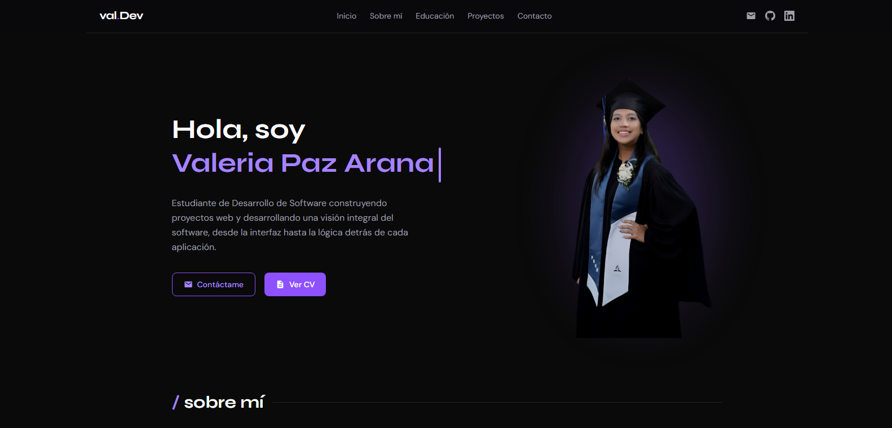

<div align="center">

  

  # val.Dev — Portafolio Personal

  Portafolio web de Valeria Paz Arana, estudiante de Desarrollo de Software.
  Diseñado para mostrar proyectos, habilidades y trayectoria académica.

  **[Ver sitio ✰](https://tu-url.vercel.app)**

  <br/>

  

</div>

---

## Stack

Next.js · React · Tailwind CSS · EmailJS · React Icons

## Paleta de colores

| Color | Hex |
|-------|-----|
| Violeta principal | `#8b5cf6` |
| Fondo | `#0a0a0a` |
| Texto secundario | `#71717a` |

## Instalación

```bash
git clone https://github.com/valeriaPaz04/portfoliovaldev.git
cd portfoliovaldev
npm install
npm run dev
```

---

Desarrollado por Valeria Paz Arana · [valeriapazarana@gmail.com](mailto:valeriapazarana@gmail.com)